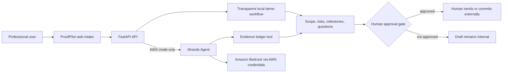

# Architecture Diagram

The local demo branch is deliberately non-AI and non-AWS. The AWS branch is a
real Strands invocation path and returns an error instead of fabricating a
model result when AWS is not configured.
